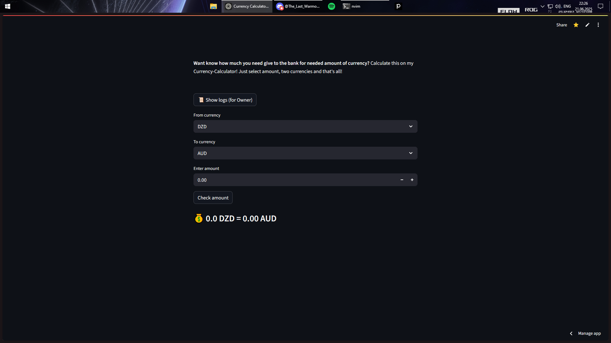

# Currencies Calculator

**Currency Converter** (Or excanger, as u want) - thats [website](https://excange-currency.streamlit.app/) can help you to know how many u need give to bank for excange ur currency to nedeed

---

### 💡 How it works:

1. **Choose your currency** in the first dropdown

2. **Choose the needed currency** in the second dropdown
   *(you can also just type it in if you don't wanna scroll)*

3. **Enter the amount**, and hit **"Check amount"**

That's it! The converter will show how much you’ll get 🔁💰

---
### 🖥 Website UI:

Here we se:
1. **3 Field**
2. 1.1 Choose first currency ("from currency", on this moment avaible 45 currencies)
3. 1.2. Choose second currency in second field ("to currency")
4. 1.3. And result - result of exchange currency (for example USD -> EUR)

5. Button "Check amount" - logically, if u press it - code calculate the required amount of currency
6. And after click button - result in "from-to; Amount; Currency" format (amount of USD -> 15.00 -> 13.02 -> EUR)
