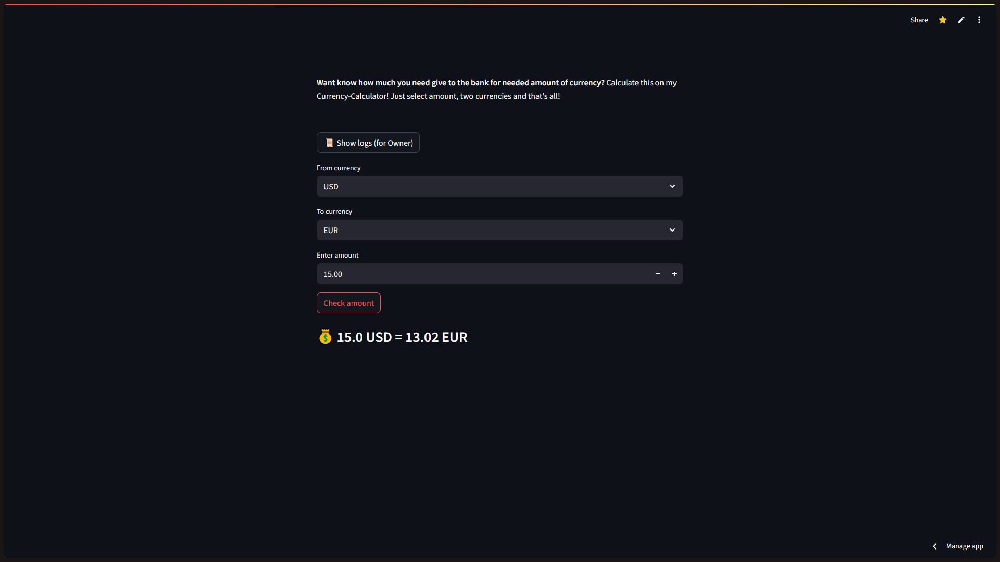

# 💸 Currency Calculator

> **Exchange or Excanger? Or Exchange?** Doesn't matter — this site will help you figure out **how much money to give the bank** when exchanging one currency for another.

🧮 **[Live Demo](https://excange-currency.streamlit.app/)**  
📦 Built with Python + Streamlit  
🔒 No API keys, no secrets, full privacy — everything comes from the **National Bank of Ukraine**!

---

## 💡 How it works

1. **Pick your source currency** in the first dropdown (e.g., USD)
2. **Pick the target currency** in the second dropdown (e.g., EUR)
3. **Enter the amount**
4. Hit **"Check amount"** — and boom 💥 — you'll get the result

🎯 Supports over **45 currencies**.

---

## 🖼 Website UI

What you see:

- 2 dropdowns for selecting currencies  
- Field for amount input  
- Button to calculate  
- Exchange result shown in `FROM → TO : AMOUNT` format  
- Bonus: `Show Logs` button — you can peek inside the log file if you're curious

---

## 🔐 Security & Privacy

- No tokens, no sensitive data — just clean code
- Exchange rates pulled **directly from NBU (National Bank of Ukraine)** using JSON
- Logs only include:
  - Visit time
  - User agent  
- There's a visible "Logs" button so **you can see what gets logged**
- `.env`, secret keys, and logs are **excluded from the repo and from deployments**

---

## 🛠 Tech Stack

- Python 3.11+
- Streamlit
- `black`, `ruff`, `detect-secrets`, `pre-commit`
- Modular code
- Clean commits(not always, but..) (After some chaos in previous repository - commits is clear)

---

## 🧠 Fun Fact

> In the early days, this project used a paid API with limits.  
> But then… the **NBU appeared like a hero** and saved the day.  
> Now it's 100% free, no auth, and more accurate.

---

## 👷 For Developers

Wanna run it locally?
Just:
1. Download the "setup_n_run.py", requirements.txt file
2. Start "pip install -r requirements.txt"
3. After downloading - start "python3 setup_n_run"
Before you can press the Shift + C, and go to "Exchange-Currency-Calculator" - from here start main.py (if u on windows - u can create the icon with path to main.py file and start from Desktop) 
